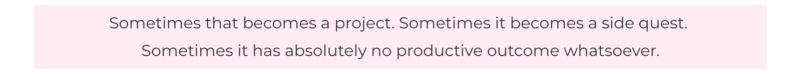

--- 
layout: single
permalink: /
---

  

    

      Curious. Creative. Calculated.
    

    

      A little chaotic—in a good way.
    

  

  I don't fit neatly into one box, and I've become okay with that. I've learned that it's easy to make assumptions about what someone can or can't do based on the box they happen to be in. I'd rather let what I create speak for itself.

  <a href="/about/">More About Me →</a>

  <section class="home-section home-section-projects">
    <h2>Projects</h2>

      

    Sometimes curiosity turns into something useful. A problem to solve, a process to improve, or an idea that keeps growing until it becomes something much bigger than the question I started with.
      

    

      <a href="/projects/">Explore Projects →</a>
    

  </section>

  <section class="home-section">
    <h2>Side Quests</h2>

    

      Not everything needs to become a serious project. Some ideas start with <em>“I wonder if…”</em> and end with several hours of questionable decisions and surprisingly useful results.
    

    

      <a href="/side-quests/">Explore the Side Quests →</a>
    

  </section>

